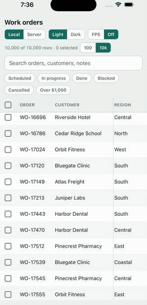

<h1 align="center">react-native-datagrid</h1>

<p align="center">
  A data grid for React Native with pinned columns that actually stay pinned.
</p>

<p align="center">
  <a href="#quick-start">Quick start</a> ·
  <a href="docs/api.md">API</a> ·
  <a href="docs/server-data.md">Server data</a> ·
  <a href="docs/theming.md">Theming</a> ·
  <a href="#limitations">Limitations</a>
</p>

<p align="center">
  <a href="https://www.npmjs.com/package/react-native-datagrid"></a>
  <a href="https://github.com/ahmdshrif/react-native-datagrid/actions/workflows/ci.yml"></a>
  
  
</p>

<p align="center">
  
</p>

> **Beta.** The API may still change before `0.1.0`. What lands next is decided by feedback from real apps — [open an issue](https://github.com/ahmdshrif/react-native-datagrid/issues).

## Why this grid

**⚡ Pinned columns that don't drift.** Sideways scrolling is driven by one Reanimated value, so rows, header and pinned columns move in the same frame. Feeding a `ScrollView`'s offset into a transform is a frame late on Android, and pinned columns visibly flicker ([#3](https://github.com/ahmdshrif/react-native-datagrid/issues/3)).

**🚀 Built on FlashList.** Only the rows on screen are mounted, so 10,000 rows scroll like 30.

**🎛 The parts business apps need.** Sorting, single and multiple selection with select-all, search and column filters, and a server-driven mode for sorting, filtering and paging on the backend.

**🎨 Yours to style.** Light and dark themes that follow the device, every colour overridable, and `renderCell` for custom cells. Screen readers read each row as one sentence in column order.

## Quick start

```sh
npx expo install react-native-datagrid@beta @shopify/flash-list react-native-reanimated react-native-worklets react-native-gesture-handler
```

<details>
<summary>Without Expo</summary>

```sh
npm install react-native-datagrid@beta @shopify/flash-list react-native-reanimated react-native-worklets react-native-gesture-handler
```

Follow the [Reanimated setup guide](https://docs.swmansion.com/react-native-reanimated/docs/fundamentals/getting-started) to add the worklets Babel plugin. On Expo, install the peers with `expo install` so they match your SDK; installing this library first can pull a Reanimated version that needs a newer React Native than your SDK ships.

</details>

Wrap your app in `GestureHandlerRootView` once, near the root:

```tsx
import { GestureHandlerRootView } from 'react-native-gesture-handler';

export default function App() {
  return <GestureHandlerRootView style={{ flex: 1 }}>{/* ... */}</GestureHandlerRootView>;
}
```

Then render a grid. It fills its parent, so give the parent a height.

```tsx
import { DataGrid } from 'react-native-datagrid';
import type { DataGridColumn } from 'react-native-datagrid';

type Order = { id: string; customer: string; status: string; amount: number };

const columns: DataGridColumn<Order>[] = [
  { key: 'id', title: 'Order', width: 96, pinned: 'left', sortable: true },
  { key: 'customer', title: 'Customer', width: 170, sortable: true },
  { key: 'status', title: 'Status', width: 120 },
  {
    key: 'amount',
    title: 'Amount',
    width: 110,
    align: 'right',
    sortable: true,
    format: (value) => `$${(value as number).toFixed(2)}`,
  },
];

export function Orders({ orders }: { orders: Order[] }) {
  return (
    <DataGrid
      data={orders}
      columns={columns}
      keyExtractor={(row) => row.id}
      selectionMode="multiple"
      onSelectionChange={(keys) => console.log(keys)}
    />
  );
}
```

Memoize `columns`, or every row re-renders when the parent does.

## Columns

A column is data plus presentation: `width` and `pinned` place it, `format` or `renderCell` draw it, `sortable` and `compare` order it.

```tsx
const columns: DataGridColumn<Order>[] = [
  // Stays visible while scrolling sideways
  { key: 'id', title: 'Order', width: 96, pinned: 'left', sortable: true },

  // Custom cell content
  {
    key: 'status',
    title: 'Status',
    width: 120,
    renderCell: ({ value }) => <StatusPill status={value as Status} />,
  },

  // A value that isn't a plain field, with its own sort order
  {
    key: 'technician',
    title: 'Technician',
    width: 160,
    getValue: (row) => row.assignee?.fullName ?? '',
    compare: (a, b) => a.assignee.rank - b.assignee.rank,
    sortable: true,
  },
];
```

Every option is in the [API reference](docs/api.md).

## Features

| | |
| --- | --- |
| **Sorting** | Tap a header to cycle ascending → descending → off. Stable, natural string order (`Item 2` before `Item 10`), empty values last. [Docs](docs/api.md#sorting) |
| **Selection** | `single` or `multiple`, with a pinned checkbox column, select-all, and controlled or uncontrolled state. [Docs](docs/api.md) |
| **Search & filters** | `searchText` ignores case and accents; per-column `text`, `values`, `range` and `custom` filters. [Docs](docs/api.md#filters) |
| **Server data** | `manualSorting`, `manualFiltering`, loading, pull-to-refresh, load more, errors with retry. [Docs](docs/server-data.md) |
| **Theming** | Light and dark, device-aware, every token overridable. [Docs](docs/theming.md) |

## Performance

Release builds, 10,000 rows × 13 columns, a checkbox column plus 2 pinned columns, over about 12 seconds of fast flings and sideways swipes. The numbers count frame intervals longer than 25 ms, a rough jank signal rather than a dropped-frame count:

| Platform | UI thread | JS thread |
| --- | --- | --- |
| iOS 26 simulator (Mac) | 0 long intervals | 0 |
| Android emulator, API 35 (Mac) | 1 | 21 |

**Not measured on physical devices yet.** Emulator results move with host load, so they say nothing reliable about low-end Android phones. Device benchmarks are the gate before `0.1.0`.

What scales with the whole dataset, not just the visible rows: sorting, key generation, and the search index (built on the first search, then reused until `data` or `columns` change). Pass stable `data`, `columns` and `keyExtractor` references.

Reproduce it yourself with `yarn example ios` or `yarn example android`, then switch on the FPS toggle in the example app.

## Compatibility

| Package | Tested with | Peer range |
| --- | --- | --- |
| react-native | 0.83.10 | `*`, New Architecture required |
| react | 19.2.0 | `*` |
| expo | SDK 55 | not required |
| @shopify/flash-list | 2.0.2 | `>=2.0.0` |
| react-native-reanimated | 4.2.1 | `>=4.0.0` |
| react-native-worklets | 0.7.4 | `>=0.5.0` |
| react-native-gesture-handler | 2.30.0 | `>=2.20.0` |

Checked on the iOS 26 simulator and an Android API 35 emulator in Release builds, plus a clean install into a fresh Expo app. Web is untested.

## How it compares

| | react-native-datagrid | Plain `FlatList` | [TanStack Table](https://tanstack.com/table) |
| --- | --- | --- | --- |
| Pinned columns + sticky header | Built in | You build it | You build it |
| Row virtualization | FlashList | FlatList | Bring your own list |
| Sorting and filtering logic | Built in | You build it | Built in, headless |
| Server paging states | Built in | You build it | You build it |
| Ready-made mobile UI | Yes | — | No, headless by design |

There is also [`@bestcoder/react-native-data-table`](https://www.npmjs.com/package/@bestcoder/react-native-data-table), which covers FlashList virtualization, fixed left and right columns, sorting and selection — including right-pinned columns, which this library does not have yet. I have not benchmarked it; compare both before choosing.

## Limitations

- Fixed row height; rows do not auto-size.
- Every mounted row renders every column. Rendering only visible columns is planned for wide tables.
- No column resizing, reordering or inline editing yet.
- Left-pinned columns only.
- No native horizontal scrollbar or sideways overscroll bounce: that is the trade for keeping pinned columns in sync.
- Not measured on physical low-end Android devices.

## Roadmap

- Physical-device benchmarks, then `0.1.0`
- Scroll reset when a new sort or filter is applied
- Column virtualization for wide tables
- Right-pinned columns
- Column resizing and inline editing, if beta users ask for them

## Contributing

Issues and pull requests are welcome, especially reports from real apps with real tables. See [CONTRIBUTING.md](CONTRIBUTING.md) for the development workflow and [RELEASING.md](RELEASING.md) for how releases are cut.

## License

MIT © [ahmdshrif](https://github.com/ahmdshrif)
